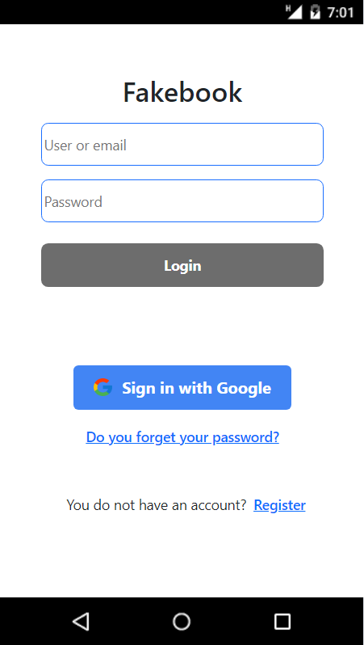
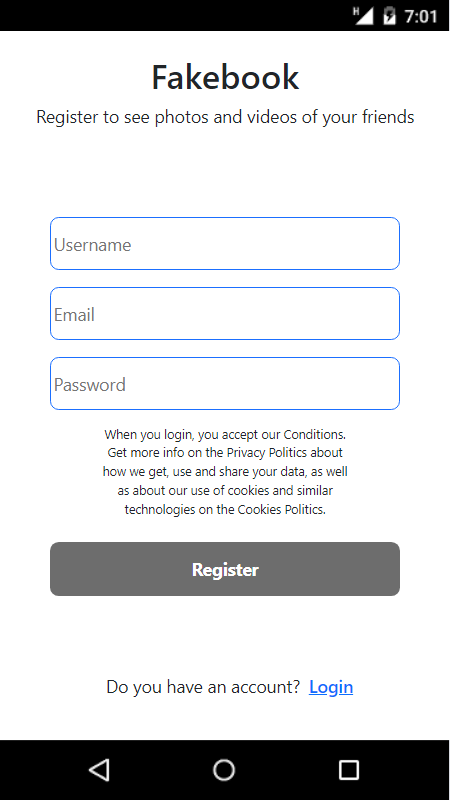
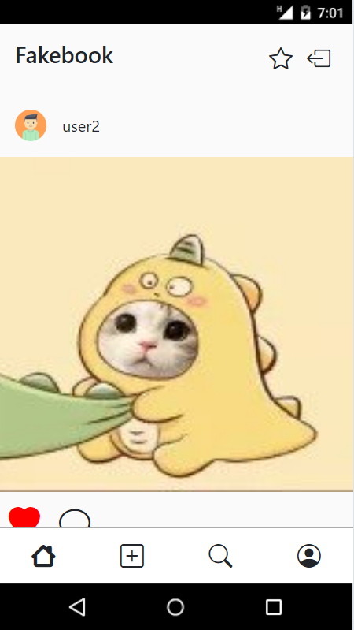
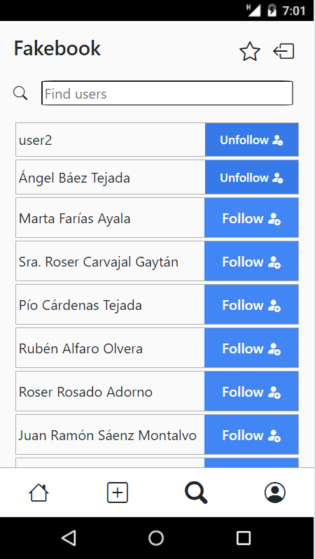
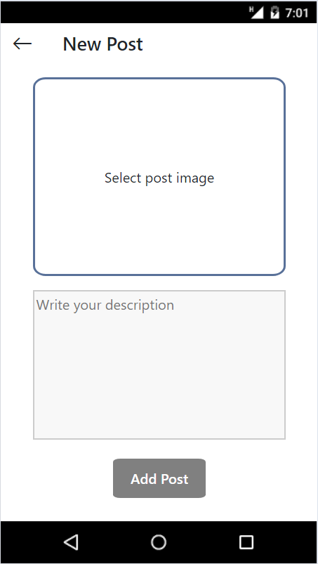
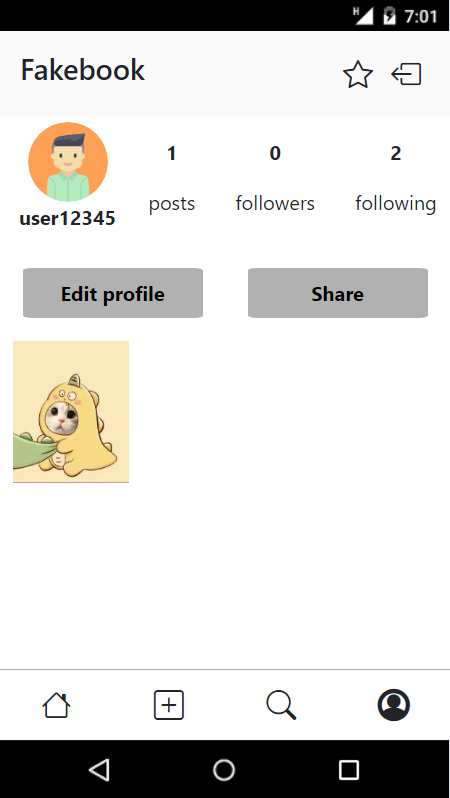
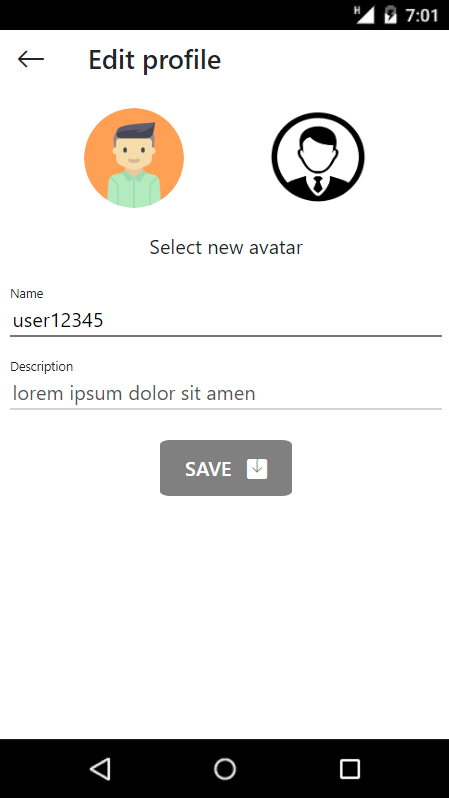
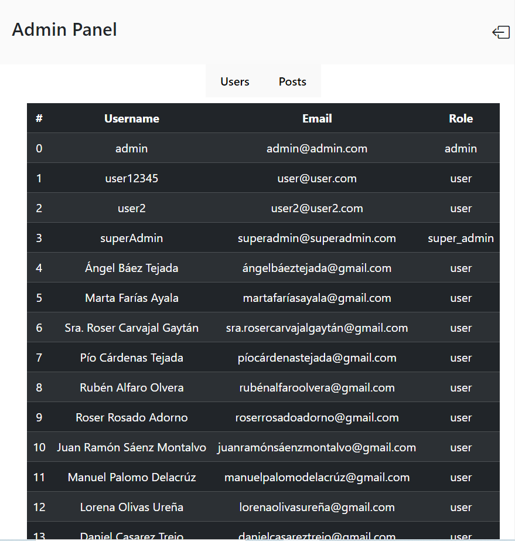

<h1 align="center">
  <br>
  <a href="http://www.amitmerchant.com/electron-markdownify"></a>
  <br>
  Fakebook Website React
  <br>
</h1>

<h4 align="center">App for social media application</h4>

<p align="center">
  <a href="#-key-features">Key Features</a> •
  <a href="#-project-objective">Project objective</a> •
  <a href="#-backend">Backend</a> •
  <a href="#️-stack">Stack</a> •
  <a href="#️-views">Views</a> •
  <a href="#️-future-improvements">Future improvements</a> •
  <a href="#-you-may-also-like">You may also like...</a>
</p>

## 🔑 Key Features

* Application for making posts and share them with your friends
* Register for create user, using JWT to generate token and Redux for persistance on the application
* Timeline with the posts of your following users
* Profile view with your data and posts, able to update the profile and detailed posts
* Admin view panel to search all the information related with the application (users and posts)
* Search interface to follow and unfollow users
* Interface to make own posts

## 🎯 Project objective

This website is a project focused on React facilities, concretely on the implementation of Redux, with the main objective to make an application to share your moments with the world and your friends. Similar to Instagram, is a social media in which, with your posts based on images and descriptions, added to the connections to users, you can show your special moments easily.

## 🔗 Backend

This project is developed based on a previous [project](https://github.com/CariblaGIT/Fakebook) that I have made for making possible all the consults that are actually done in this application

## ⌨️ Stack
<div align="center">
<a href="https://es.react.dev/">
    
</a>
<a href="https://www.npmjs.com/package/react-router-dom">
    
</a>
<a href="https://www.npmjs.com/">
    
</a>
<a href="https://developer.mozilla.org/es/docs/Web/JavaScript">
    
</a>
<a href="https://jwt.io/">
    
</a>
<a href="https://developer.mozilla.org/es/docs/Web/CSS">
    
</a>
<a href="https://getbootstrap.com/">
    
</a>
<a href="https://railway.app/">
    
</a>
<a href="https://redux.js.org/">
    
</a>
 </div>

 ## 👨‍💻 Installation

Follow the steps to emulate the project in your local device. But is not necessary because the project has been uploaded to AWS, so you can skip the installation and use the following URL to make all the consults in front of your localhost one. <b>IMPORTANT : Actually is not on production de application, so for using it you must to follow the steps after the link, sorry for the problem. </b> 
<div align="center">
<a href="https://cariblagit.github.io/FakebookReact/">🚀 App deployed 🚀</a>
</div>

1. Clone repo
2. Install dependencies:
    ```bash
    npm install
    ```
3. Launch the project in your local device:
    ```bash
    npm run dev
    ```
After that, in localhost:PORT, will be launched the application, and you will be on the landing page (Login interface)

## 🖥️ Views

<h4 align="center">Login & Register</h4>

<div align="center">
    
    
</div>

<h4 align="center">Timeline</h4>

<div align="center">
    
</div>

<h4 align="center">Search</h4>

<div align="center">
    
</div>

<h4 align="center">New post</h4>

<div align="center">
    
</div>

<h4 align="center">Profile</h4>

<div align="center">
    
</div>

<h4 align="center">Edit Profile</h4>

<div align="center">
    
</div>

<h4 align="center">Admin panel</h4>

<div align="center">
    
</div>

## 🛠️ Future improvements

⬜ Adding the comments to the posts
<br>
⬜ Better interface to search users (debouncer and not loading all users at the beggining)
<br>
⬜ Better admin panel experience
<br>
⬜ Favourites posts selection
<br>
⬜ Encrypt the Redux modules

## 👀 You may also like...

- [Between Sins](https://gitlab.com/daghdha1/betweensins) - RPG videogame 
- [Mars Alienated](https://gitlab.com/AdrianGarciaAndreu/mars-alienated-rv-htc) - VR escape room experience in a space station

<div align="center">
<a href="https://www.linkedin.com/in/carlos-ibañez-lamas-74487b228/" target="_blank"></a>
<a href="https://gitlab.com/CariblaGTI" target="_blank"></a>
</div>

------

<div align="center">
<a href="#App-for-social-media-application">🔼 Back to top 🔼</a>
</div>